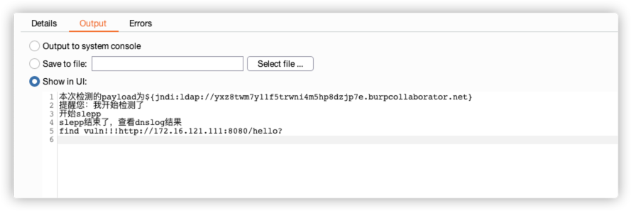
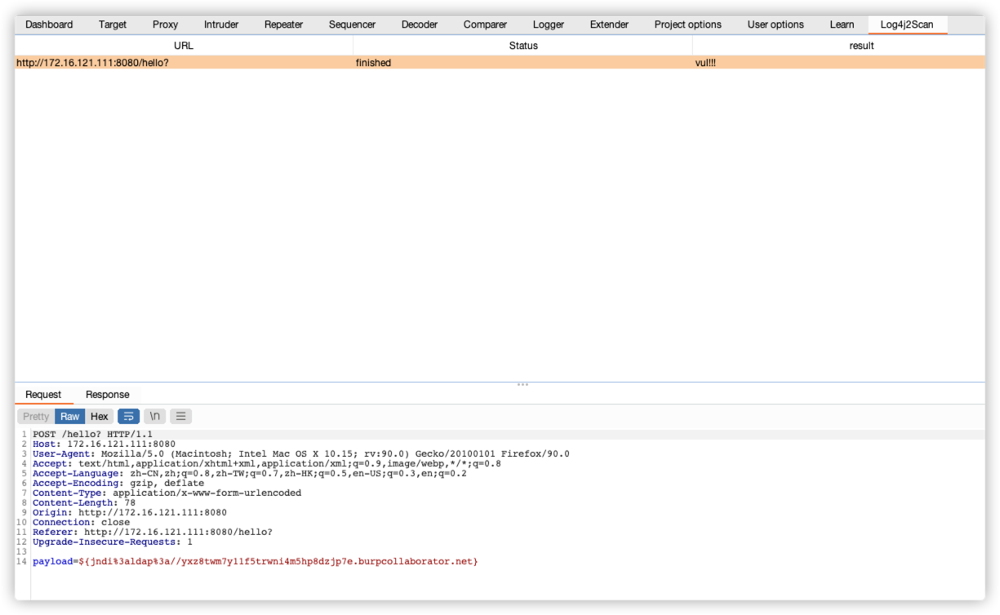

# BurpLog4j2Scan

### Description
BurpLog4j2Scan is a Burp Suite Extension written in JAVA which could be useful as scan log4j2rce.

### Screenshot
##### start scan

##### process

##### result

### Link
https://github.com/Maskhe/FastjsonScan

https://github.com/whwlsfb/Log4j2Scan